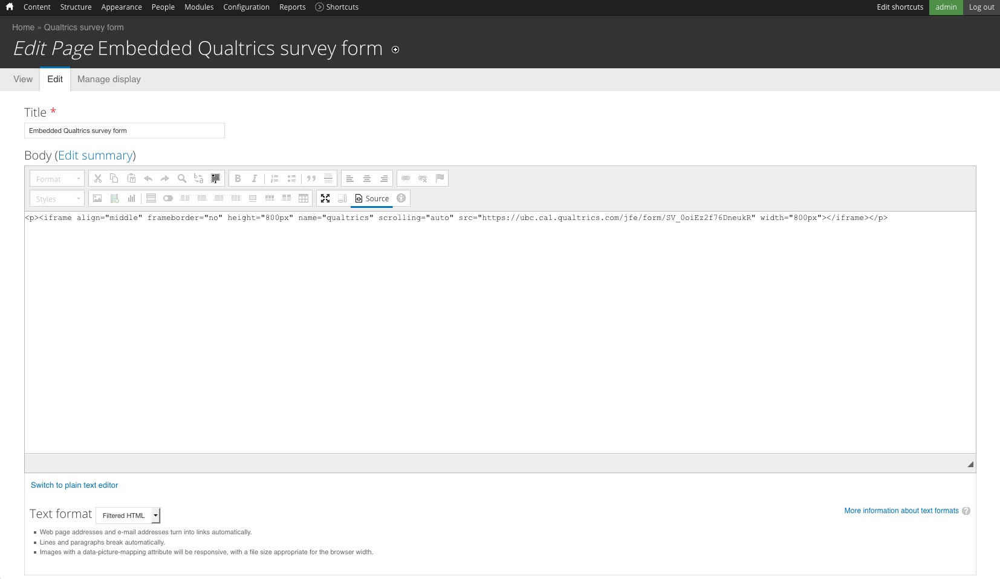
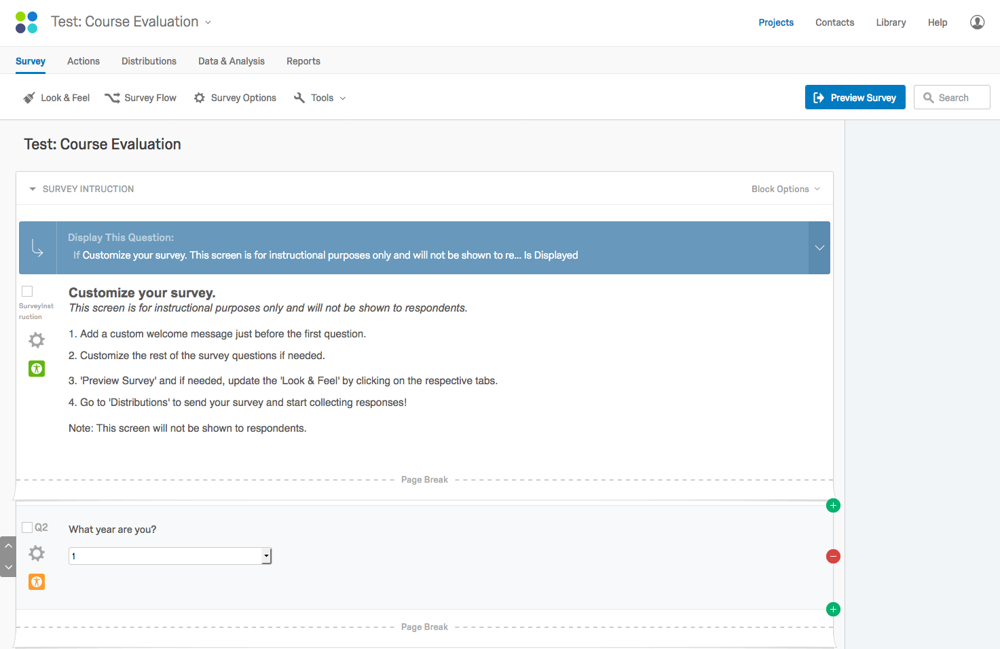
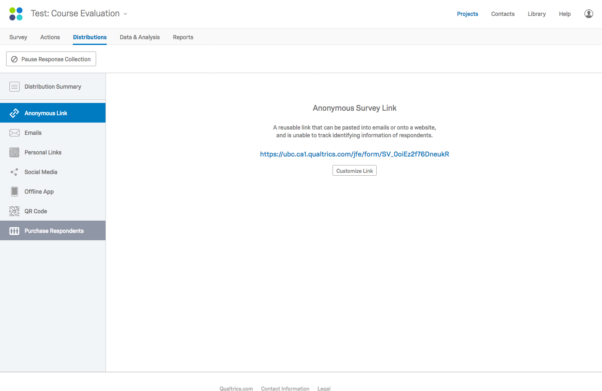
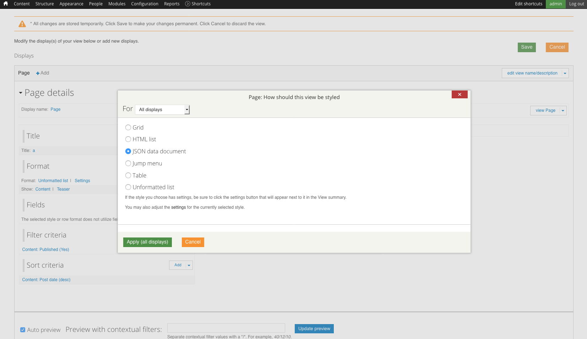
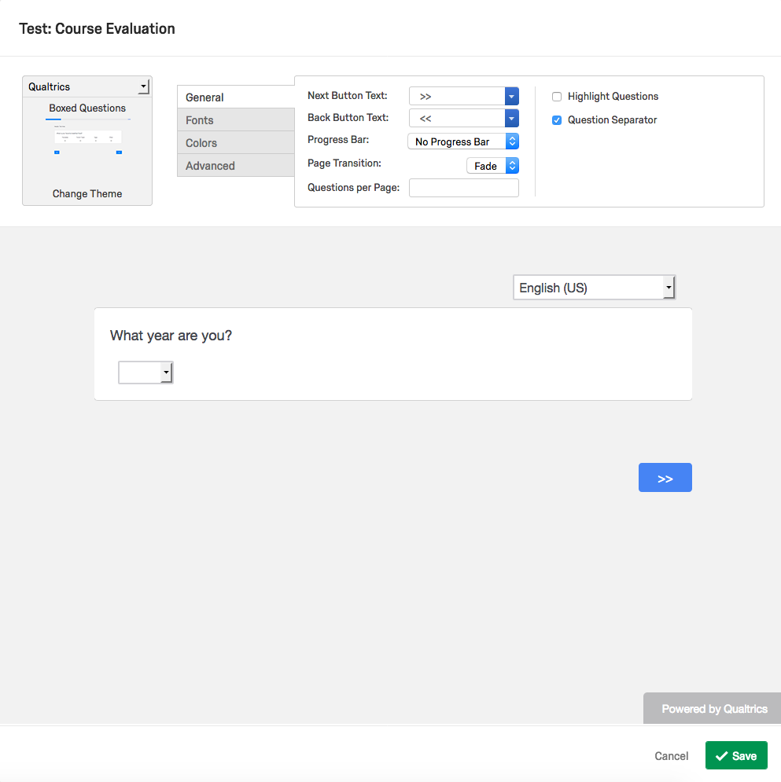

# UBC Qualtrics-Drupal integration
Table of Contents:
* <a href="#embedding-qualtrics-survey">Embedding Qualtrics survey to a website</a>
* <a href="#anonymous-survey-link">How to get __[Anonymous Survey Link]__</a>
* <a href="#exporting-json-feeds">Exporting JSON feeds from Drupal to Qualtrics</a>
	1. Creating a drop-down list
	2. Creating an autocomplete text field

A link to Qualtrics survey for demo: https://ubc.ca1.qualtrics.com/jfe/form/SV_0oiEz2f76DneukR
<br />
A link to Drupal website for demo: https://qualtrics.dp7prod.webi.it.ubc.ca/
> Note: all screenshots are from Drupal website for demo which includes ___Administration menu___ module installed and enabled. If you started your own Drupal website, you can install the module to have the same look and feel of the website we are demonstrating.
## <div id="embedding-qualtrics-survey">Embedding Qualtrics survey to a website:</div>
1. Download Drupal and start building your own Drupal website.
2. Create a basic page:
    Go to Content > Add content > Page.
    
    Select  button located at the bottom row of the text editing tools.
    In Body field, add:
    <br />
```html
<iframe align="middle" frameborder="no" height="800px" name="qualtrics" scrolling="auto" src=[Anonymous Survey Link] width="800px"></iframe>
```

<br />
You can copy and paste the above line, but you __must__ replace the [Anonymous Survey Link] with your own survey link.
You can retrieve your own [Anonymous Survey Link] with the step-by-step instruction provided __below__.
In the case of demo, the link is https://ubc.ca1.qualtrics.com/jfe/form/SV_0oiEz2f76DneukR.

3. Save the page to see the survey embedded to the designated page.

## <div id="anonymous-survey-link">How to get __[Anonymous Survey Link]__:</div>
1. Go to Qualtrics website and login using your CWL account.
2. Create a survey for demo.

For the purpose of demo, I created a survey titled as ___Test: Course Evaluation___.
3. Click the survey title to see the page similar to this:

4. Go to __Distribution__ tab located at the top of the page, and the link will be provided when the page is loaded.


## <div id="exporting-json-feeds">Exporting JSON feeds from Drupal to Qualtrics:</div>
1. Create a page view:
* Go to Structure > Views > Add new view.
* Select __Create a page__ and click Continue & Edit.
* Under __Format__ field, click Unformatted list.
* Click __JSON data document__ and click __Apply (all displays)__.
<br />
2. Once saved, you will be able to see the preview at the bottom of the page that is similar to this:
```
{
  "nodes" : [
    {
      "node" : {
        "title" : "Wood Products Processing"
      }
    },
    {
      "node" : {
        "title" : "Statistics"
      }
    },
    {
      "node" : {
        "title" : "Pharmacy"
      }
    },
...
```
If you click __Settings__ next to JSON data document under __Format__ field, you can modify root object name (___nodes___ in this demo) and top-level child object(___node___ in this demo).<br /><br />
3. Go to Qualtrics website and login using your CWL account.<br /><br />
4. Create a survey, or locate the existing survey that you wish to import JSON feeds from your Drupal website.<br /><br />
5. Create a question of type __Descriptive Text__.<br />
For the purpose of demo, I created a question titled as ___Test drop-down list field___ and ___Test autocomplete field___.<br /><br />
6. Click __Advanced Question Options__ on the left corner of the question card, and click __Add JavaScript__.<br /><br />
<br /><br />
7. There are __two__ options: to create a drop-down list or an autocomplete text field:<br />
* To create a __drop-down list__, copy and paste the code provided below:<br />
In JavaScript:
```javascript
Qualtrics.SurveyEngine.addOnReady(function()
{
	$.getJSON('https://[your-site-domain]/[endpoint-path]', function(data) {
		var nodes = data.nodes;
		var select = document.getElementById('select');
		for (var item of nodes) {
			var temp = document.createElement('option');
			var text = document.createTextNode(item.node.title);
			temp.appendChild(text);
			select.appendChild(temp);
		}
	});
});
```
In jQuery:
```jquery
Qualtrics.SurveyEngine.addOnReady(function()
{
	$.getJSON('https://[your-site-domain]/[endpoint-path]', function(data) {
		var nodes = data.nodes;
		for (var node of nodes) {
			$('#select').append('<option value=\"' + node.node.Nid + '\">' + node.node.title + '</option>');
		}
	});
});
```
* To create an __autocomplete text field__, copy and paste the code provided below:<br />
```jquery
Qualtrics.SurveyEngine.addOnReady(function()
{
	$.getJSON('https://[your-site-domain]/[endpoint-path]', function(data) {
		var nodes = data.nodes;
		$( function() {
			var availableTags = [];
			for (var node of nodes) {
				availableTags.push(node.node.title);
			}
			$( "#tags" ).autocomplete({
				source: availableTags
			});
		});
	});

});
```
> Source: Copyright 2018 The jQuery Foundation. jQuery License

Your __[endpoint-path]__ is the path assigned to your page view

8. Click __save__ button, and find  button on top of the page.
9. Click and you will see a pop-up window that looks like this:

10. Click __Advanced__ option and add below lines to __Header__ section:
```html
  <meta charset="utf-8">
  <meta name="viewport" content="width=device-width, initial-scale=1">
  <link rel="stylesheet" href="//code.jquery.com/ui/1.12.1/themes/base/jquery-ui.css">
  <link rel="stylesheet" href="/resources/demos/style.css">
  <script src="https://code.jquery.com/jquery-1.12.4.js"></script>
  <script src="https://code.jquery.com/ui/1.12.1/jquery-ui.js"></script>
```
11. Click __save__ button, and click your question to edit.
12. Click __Rich Text Editor__.

13. Click  button.
14. For __Drop-down list__, copy and paste below line:
```html
<select id="select"></select>
```
15. For __Autocomplete text field__, copy and paste below line:
```html
<div class="ui-widget"><label for="tags">Enter: </label> <input id="tags" /></div>
```
16. Click __Save__ button, and click  to have a preview look of your survey.

